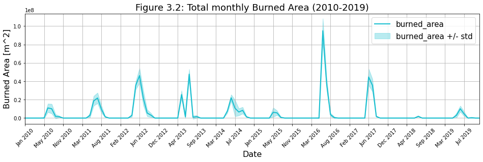

# Playing with Fire

This is a data science project analyzing the occurance and frequency of wildfire events on the island of Sardinia, Italy. It is based on the Climate Datastore [Modis](https://cds.climate.copernicus.eu/cdsapp#!/dataset/satellite-fire-burned-area?tab=overview) and [ERA5](https://cds.climate.copernicus.eu/cdsapp#!/dataset/reanalysis-era5-single-levels-monthly-means?tab=overview) datasets to acquire fire and climatic data over a time period of 10 years (2010 to 2019).

  

## Usage
Install the required Python dependencies in `container/requirements.txt`. Optionally you can setup the complete environment in a dedicated docker container by using `docker-compose up`.
